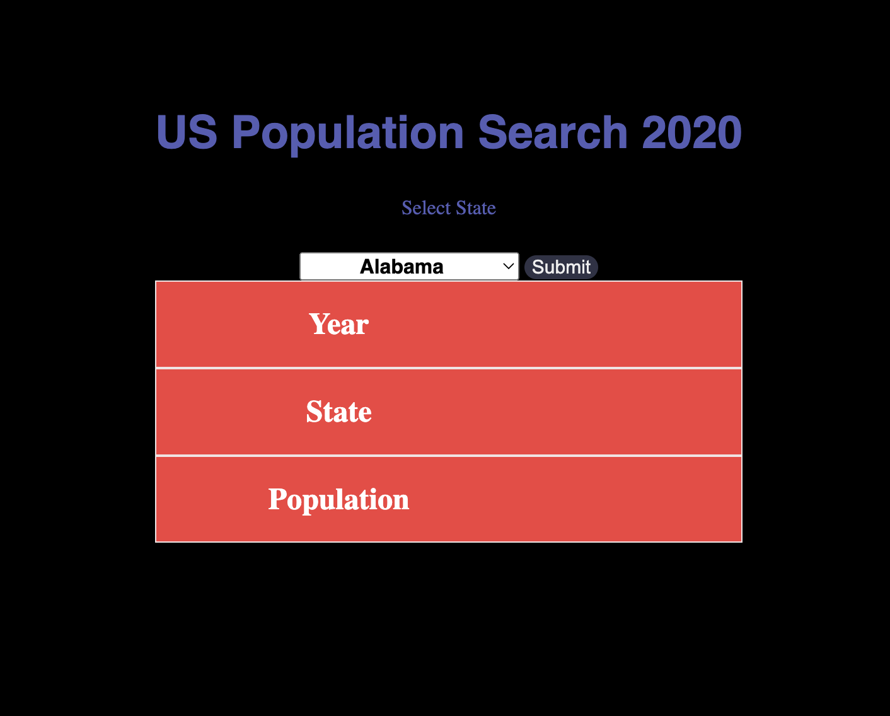

# phase-one-final-project
## Intro:
Curiosity pushes humans to come up with incredible ideas like the Airplane, or the lightbulb. Some people are curious about different things, like “How fast can this car drive”, or “How many people live in the state of Maine” (Who ever heard of Maine, right?).

Well here I’ve created an application to allow users to view any states population.

### How it works:
**Photo of screen once state is chosen**

input any state from a dropdown. Based off of the chosen state users will be able to see the country, state, and the states population.

#### Hidden features:
**photo of hidden features**
1. If user clicks on "population" a map of the united states will appare.
*Photo for this feature*
2. If user clicks on "state" user will see pop-up of that states governments website.
*Photo for this feature*

##### Key details:
This application only shows data from the year 2020.

###### Sources:
* [API: Parent website:] (https://datausa.io/about/api/)
* [API:] (https://datausa.io/api/data?drilldowns=State&measures=Population&year=latest)
* [US Map:] (https://www.infoandopinion.com/wp-content/uploads/2021/07/USA-Map-Blank.png)
* [Thumbs up:] (https://cdn-icons-png.flaticon.com/512/5277/5277377.png)
